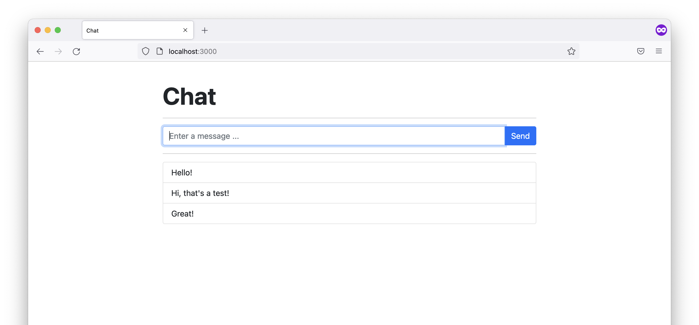

<h1 align="center">Chat</h1>
<p align="center">A simple chat application</p>


<p align="center">
    <a href="https://github.com/jarne/Chat/blob/master/package.json">
        
    </a>
    <a href="https://nodejs.org">
        
    </a>
    <a href="https://circleci.com/gh/jarne/Chat">
    
    </a>
    <a href="https://github.com/jarne/Chat/blob/master/LICENSE">
        
    </a>
    <a href="https://gitter.im/jarne/Chat">
        
    </a>
</p>

#

[• Description](#-description)  
[• Install](#-install)  
[• Usage](#-usage)  
[• Contribution](#-contribution)  
[• License](#%EF%B8%8F-license)

## 📙 Description
This is a simple chat application built with [Node.js](https://github.com/nodejs/node), [Socket.IO](https://github.com/socketio/socket.io) and [Bootstrap](https://github.com/twbs/bootstrap). You can send messages into the chat and they're displayed in realtime for the other chatters.

Here's a screenshot of the page:



## 📦 Install
The application is developed and tested with Node.js v9.x. You can checkout this project with the following command:

```
$ git clone https://github.com/jarne/Chat.git
```

After this, you need to install the dependencies with:

```
$ npm install
```

## 🖱 Usage
In order to start the application, run the following command in the application directory:

```
$ npm start
```

By default, the web server is now running on port 3000, so you can access it by opening `http://localhost:3000` in your web browser.

## 🙋‍ Contribution
Contributions are always very welcome! It's completly equally if you're a beginner or a more experienced developer.

Please read our **[Contribution Guidelines](CONTRIBUTING.md)** before creating an issue or submitting a pull request.

Thanks for your intrest 🎉👍!

## 👨‍⚖️ License
[](http://creativecommons.org/licenses/by-sa/4.0/)

[Chat](https://github.com/jarne/Chat) by [jarne](https://github.com/jarne) is licensed under a [Creative Commons Attribution-ShareAlike 4.0 International License](http://creativecommons.org/licenses/by-sa/4.0/). Permissions beyond the scope of this license may be available on request.
